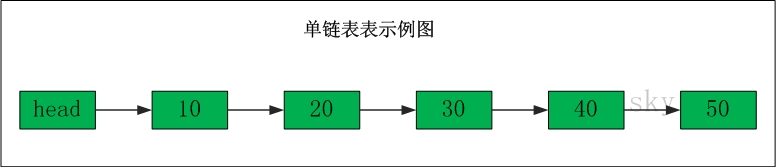
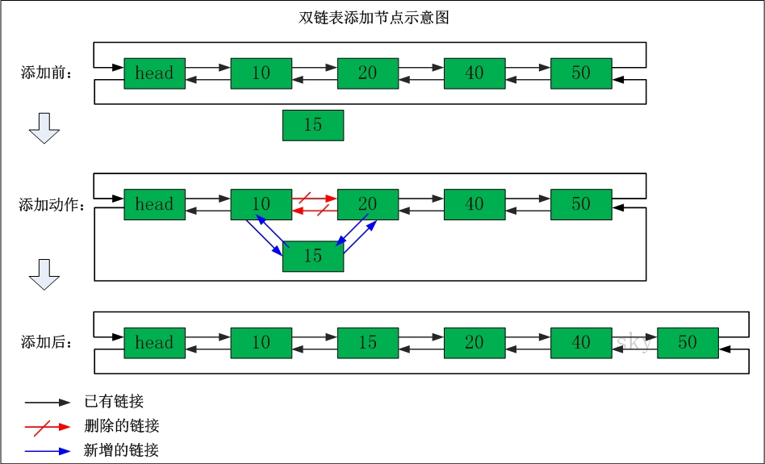

# 数组、单链表和双链表介绍 以及 双向链表

原文： [http://www.cnblogs.com/skywang12345/p/3561803.html](http://www.cnblogs.com/skywang12345/p/3561803.html)

## 概要

线性表是一种线性结构，它是具有相同类型的n(n≥0)个数据元素组成的有限序列。本章先介绍线性表的几个基本组成部分：数组、单向链表、双向链表；随后给出双向链表的C、C++和Java三种语言的实现。内容包括：

- 数组
- 单向链表
- 双向链表

## 数组

数组有上界和下界，数组的元素在上下界内是连续的。

存储10,20,30,40,50的数组的示意图如下：

数组的特点是：数据是连续的；随机访问速度快。

数组中稍微复杂一点的是多维数组和动态数组。对于C语言而言，多维数组本质上也是通过一维数组实现的。至于动态数组，是指数组的容量能动态增长的数组；对于C语言而言，若要提供动态数组，需要手动实现；而对于C++而言，STL提供了Vector；对于Java而言，Collection集合中提供了ArrayList和Vector；对于Golang语言而言，slice有动态数组的效果。

#### 目标

实现一个可自动调整大小的动态数组。

- [ ] 实现一个动态数组（可自动调整大小的可变数组）：
   - [ ] 练习使用数组和指针去编码，并且指针是通过计算去跳转而不是使用索引
   - [ ] 通过分配内存来新建一个原生数据型数组
      - 可以使用 int 类型的数组，但不能使用其语法特性
      - 从大小为16或更大的数（使用2的倍数 —— 16、32、64、128）开始编写
   - [ ] size() —— 数组元素的个数
   - [ ] capacity() —— 可容纳元素的个数
   - [ ] is_empty()
   - [ ] at(index) —— 返回对应索引的元素，且若索引越界则愤然报错
   - [ ] push(item)
   - [ ] insert(index, item) —— 在指定索引中插入元素，并把后面的元素依次后移
   - [ ] prepend(item) —— 可以使用上面的 insert 函数，传参 index 为 0
   - [ ] pop() —— 删除在数组末端的元素，并返回其值
   - [ ] delete(index) —— 删除指定索引的元素，并把后面的元素依次前移
   - [ ] remove(item) —— 删除指定值的元素，并返回其索引（即使有多个元素）
   - [ ] find(item) —— 寻找指定值的元素并返回其中第一个出现的元素其索引，若未找到则返回 -1
   - [ ] resize(new_capacity) // 私有函数
      - 若数组的大小到达其容积，则变大一倍
      - 获取元素后，若数组大小为其容积的1/4，则缩小一半
   - [ ] 时间复杂度
      - 在数组末端增加/删除、定位、更新元素，只允许占 O(1) 的时间复杂度（平摊（amortized）去分配内存以获取更多空间）
      - 在数组任何地方插入/移除元素，只允许 O(n) 的时间复杂度
   - [ ] 空间复杂度
      - 因为在内存中分配的空间邻近，所以有助于提高性能
      - 空间需求 = （大于或等于 n 的数组容积）* 元素的大小。即便空间需求为 2n，其空间复杂度仍然是 O(n)

## 单向链表

单向链表(单链表)是链表的一种，它由节点组成，每个节点都包含下一个节点的指针。

单链表的示意图如下：

`表头为空，表头的后继节点是"节点10"(数据为10的节点)，"节点10"的后继节点是"节点20"(数据为10的节点)，...`

### 单链表删除节点

删除"节点30"

**删除之前：**"节点20" 的后继节点为"节点30"，而"节点30" 的后继节点为"节点40"。

**删除之后：**"节点20" 的后继节点为"节点40"。

### 单链表添加节点

在"节点10"与"节点20"之间添加"节点15"

**添加之前：**"节点10" 的后继节点为"节点20"。
**添加之后：**"节点10" 的后继节点为"节点15"，而"节点15" 的后继节点为"节点20"。

单链表的特点是：`节点的链接方向是单向的；相对于数组来说，单链表的的随机访问速度较慢，但是单链表删除/添加数据的效率很高。`

#### 目标

实现（我实现了使用尾指针以及没有使用尾指针这两种情况）：

- [ ] size() —— 返回链表中数据元素的个数
- [ ] empty() —— 若链表为空则返回一个布尔值 true
- [ ] value_at(index) —— 返回第 n 个元素的值（从0开始计算）
- [ ] push_front(value) —— 添加元素到链表的首部
- [ ] pop_front() —— 删除首部元素并返回其值
- [ ] push_back(value) —— 添加元素到链表的尾部
- [ ] pop_back() —— 删除尾部元素并返回其值
- [ ] front() —— 返回首部元素的值
- [ ] back() —— 返回尾部元素的值
- [ ] insert(index, value) —— 插入值到指定的索引，并把当前索引的元素指向到新的元素
- [ ] erase(index) —— 删除指定索引的节点
- [ ] value_n_from_end(n) —— 返回倒数第 n 个节点的值
- [ ] reverse() —— 逆序链表
- [ ] remove_value(value) —— 删除链表中指定值的第一个元素
        

## 双向链表

双向链表(双链表)是链表的一种。和单链表一样，双链表也是由节点组成，它的每个数据结点中都有两个指针，分别指向直接后继和直接前驱。所以，从双向链表中的任意一个结点开始，都可以很方便地访问它的前驱结点和后继结点。一般我们都构造双向循环链表。

双链表的示意图如下：

`表头为空，表头的后继节点为"节点10"(数据为10的节点)；"节点10"的后继节点是"节点20"(数据为10的节点)，"节点20"的前继节点是"节点10"；"节点20"的后继节点是"节点30"，"节点30"的前继节点是"节点20"；...；末尾节点的后继节点是表头。`

### 双链表删除节点

删除"节点30"

**删除之前：**"节点20"的后继节点为"节点30"，"节点30" 的前继节点为"节点20"。"节点30"的后继节点为"节点40"，"节点40" 的前继节点为"节点30"。

**删除之后：**"节点20"的后继节点为"节点40"，"节点40" 的前继节点为"节点20"。

### 双链表添加节点

在"节点10"与"节点20"之间添加"节点15"

**添加之前：**"节点10"的后继节点为"节点20"，"节点20" 的前继节点为"节点10"。

**添加之后：**"节点10"的后继节点为"节点15"，"节点15" 的前继节点为"节点10"。"节点15"的后继节点为"节点20"，"节点20" 的前继节点为"节点15"。

