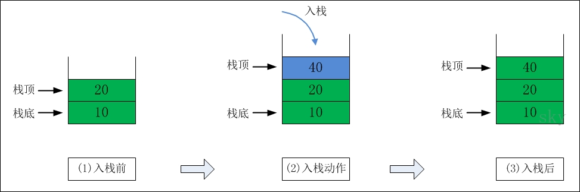

# 栈

## 概述

原文：[http://www.cnblogs.com/skywang12345/p/3562239.html](http://www.cnblogs.com/skywang12345/p/3562239.html)

栈（stack）是限定仅在表尾进行插入和删除操作的线性表。

我们把允许插入和删除的一端称为栈顶（top），另一端称为栈底（bottom），不含任何数据的栈称为空栈。栈又称为后进先出（Last In First Out）的线性表，简称 LIFO 结构。

栈的插入操作，叫作进栈，也称压栈、入栈。

栈的删除操作，叫作出栈，也有叫作弹栈。

## 栈的介绍

栈（stack），是一种线性存储结构，它有以下几个特点：

-  栈中数据是按照"后进先出（LIFO, Last In First Out）"方式进出栈的。
-  向栈中添加/删除数据时，只能从栈顶进行操作。

栈通常包括的三种操作：push、peek、pop。

- push -- 向栈中添加元素。
- peek -- 返回栈顶元素。
- pop  -- 返回并删除栈顶元素的操作。

### 1. 栈的示意图

栈中的数据依次是 30 --> 20 --> 10

### 2. 出栈

**出栈前：** 栈顶元素是30。此时，栈中的元素依次是 30 --> 20 --> 10 

**出栈后：** 30出栈之后，栈顶元素变成20。此时，栈中的元素依次是 20 --> 10

### 3. 入栈

**入栈前：** 栈顶元素是20。此时，栈中的元素依次是 20 --> 10 

**入栈后：** 40入栈之后，栈顶元素变成40。此时，栈中的元素依次是 40 --> 20 --> 10

