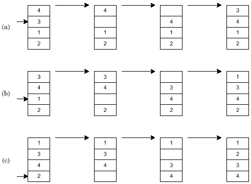

# 插入排序

## 概述

插入排序就是每一步都将一个待排数据按其大小插入到已经排序的数据中的适当位置，直到全部插入完毕。 

插入排序方法分直接插入排序和折半插入排序两种，这里只介绍直接插入排序，折半插入排序留到“查找”内容中进行。
 
图1演示了对4个元素进行直接插入排序的过程，共需要(a),(b),(c)三次插入。

## 算法步骤

- 1、默认序列中的第0个元素是有序的（因为只有一个元素a[0]嘛，自然是有序的）；

- 2、从下标为1（下标从0开始）的元素开始，取当前下标i位置处的元素a[i]保存到一个临时变量waitInsert里；

- 3、对前半部分有序序列的循环遍历，并与waitInsert比较，直到遇到一个比waitInsert小的元素（这里默认是从小到大排序），此时的下标为j，那么现在只要对a[j+1]进行赋值waitInsert即可；

- 4、将待插入元素的下标 i 向后推移一个位置；

- 5、重复进行第2步到第4步，直到乱序序列中的元素被全部插入到有序序列中；

经过以上5个步骤之后，整体序列必然有序，排序完成。

## 算法分析

### 直接插入排序的算法性能

.jpg)

### 时间复杂度 

当数据正序时，执行效率最好，每次插入都不用移动前面的元素，时间复杂度为O(N)。 

当数据反序时，执行效率最差，每次插入都要前面的元素后移，时间复杂度为O(N2)。

所以，数据越接近正序，直接插入排序的算法性能越好。 

 

### 空间复杂度

由直接插入排序算法可知，我们在排序过程中，需要一个临时变量存储要插入的值，所以空间复杂度为 1 。

 

### 算法稳定性

直接插入排序的过程中，不需要改变相等数值元素的位置，所以它是稳定的算法。 

### 参考文档

- [排序三 直接插入排序](http://www.cnblogs.com/jingmoxukong/p/4303270.html)
- [排序算法一：直接插入排序](http://blog.csdn.net/lg1259156776/article/details/48689323)
- [ 排序算法系列：插入排序算法](http://blog.csdn.net/lemon_tree12138/article/details/50968422)