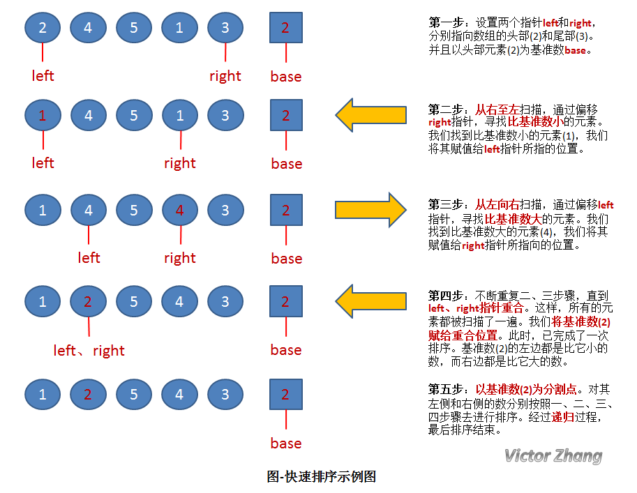
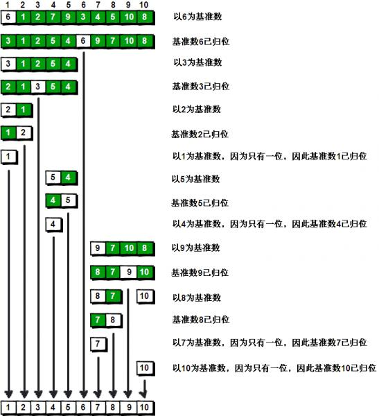

# 快速排序

快速排序是一种交换排序。

快速排序由C. A. R. Hoare在1962年提出。

它的基本思想是：

    1．先从数列中取出一个数作为基准数。

    2．分区过程，将比这个数大的数全放到它的右边，小于或等于它的数全放到它的左边。

    3．再对左右区间重复第二步，直到各区间只有一个数。

虽然快速排序称为分治法，但分治法这三个字显然无法很好的概括快速排序的全部步骤。

详细的图解往往比大堆的文字更有说明力，所以直接上图：

上图中，演示了快速排序的处理过程：

初始状态为一组无序的数组：2、4、5、1、3。

经过以上操作步骤后，完成了第一次的排序，得到新的数组：1、2、5、4、3。

新的数组中，以2为分割点，左边都是比2小的数，右边都是比2大的数。

因为2已经在数组中找到了合适的位置，所以不用再动。

2左边的数组只有一个元素1，所以显然不用再排序，位置也被确定。（注：这种情况时，left指针和right指针显然是重合的。因此在代码中，我们可以通过设置判定条件left必须小于right，如果不满足，则不用排序了）。

而对于2右边的数组5、4、3，设置left指向5，right指向3，开始继续重复图中的一、二、三、四步骤，对新的数组进行排序。

## 算法分析

### 快速排序算法的性能

.jpg)

### 时间复杂度

当数据有序时，以第一个关键字为基准分为两个子序列，前一个子序列为空，此时执行效率最差。

而当数据随机分布时，以第一个关键字为基准分为两个子序列，两个子序列的元素个数接近相等，此时执行效率最好。

所以，数据越随机分布时，快速排序性能越好；数据越接近有序，快速排序性能越差。

### 空间复杂度

快速排序在每次分割的过程中，需要 1 个空间存储基准值。而快速排序的大概需要 Nlog2N次 的分割处理，所以占用空间也是 Nlog2N 个。

### 算法稳定性

在快速排序中，相等元素可能会因为分区而交换顺序，所以它是不稳定的算法。

